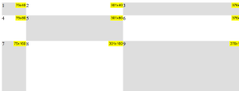
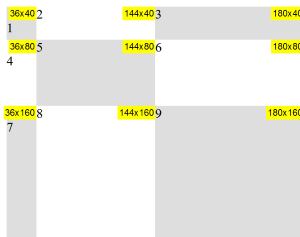
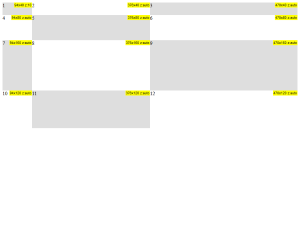

# Blocks Sizing

Appends a label with size to elements matched by a CSS selector, defaults to immediate children of `.sizing`.
 * Default labels contains width and height and are floated to the right.
 * Responsive 

Sample on big screen

 

Sample on small screen

Default with `zIndex` parameter as `true`

## Installation

Just add `sizing.js` to your project, it will match by default all parent containers with `.sizing` class.
`

	

	

	

	<!-- and so on... ->

`

You can provide another CSS selector using the `Sizing(<selector>)` initialiser.

Optionally, add `sizing.css` stylesheet, it sets default styling for size labels.

###Custom parent selector

**HTML**
`

	

	

	

	<!-- and so on... ->

`

**JS**

`
Sizing('.parent');
`

## Usage
The Sizing function has the following signature
 
`Sizing(<CSS selector>, [zIndex])`

Where

`<CSS selector>` **string**: any CSS selector

`zIndex` **boolean** *optional*: adds `z-index` value to the labels.

Thank's.
  
